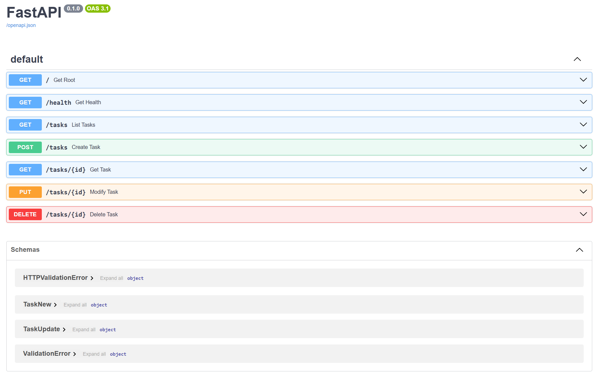

# To-Do List CRUD API

A simple in-memory To-Do List REST API built with **Python + FastAPI**. It supports creating, reading, updating and deleting tasks, plus filtering, search, computed statistics and a reset endpoint for testing.

Tasks are stored in an in-memory dictionary (`{id: Task}`) for O(1) lookups — data is lost when the server restarts.

## Requirements

- Python 3.10+
- [uv](https://docs.astral.sh/uv/) (package & project manager)

## Installation

```powershell
# clone the repo, then from the project folder:
uv sync          # creates .venv and installs all dependencies from uv.lock
```

## Run the server

```powershell
uv run fastapi dev app/main.py
```

The API will be available at `http://localhost:8000`.

- Interactive docs (Swagger UI): http://localhost:8000/docs
- Alternative docs (ReDoc): http://localhost:8000/redoc

## Endpoints

| Method | Path | Description | Success | Errors |
|--------|------|-------------|---------|--------|
| GET | `/` | API description | 200 | — |
| GET | `/health` | Health check | 200 | — |
| GET | `/tasks` | List tasks. Optional query params: `done` (bool), `search` (substring in title, case-insensitive) | 200 | 400 (invalid query) |
| GET | `/tasks/{id}` | Get one task by id | 200 | 404 |
| GET | `/stats` | Computed statistics: `{"total", "done", "open"}` | 200 | — |
| POST | `/tasks` | Create a task. Body: `{"title": "...", "done": false}` (`done` optional) | 201 | 400 (invalid/empty body) |
| POST | `/reset` | Reset the store to its initial state (3 example tasks) | 200 | — |
| PUT | `/tasks/{id}` | Update `title` and/or `done` | 200 | 400, 404 |
| DELETE | `/tasks/{id}` | Delete a task | 204 (no body) | 404 |

All errors are returned as JSON with the shape `{"error": "<message>"}`.

## Examples

### Get one task

```powershell
curl.exe -i http://localhost:8000/tasks/1
```

```
HTTP/1.1 200 OK
content-type: application/json

{"title":"Make API","done":true,"id":1}
```

### Task not found → 404

```powershell
curl.exe -i http://localhost:8000/tasks/99
```

```
HTTP/1.1 404 Not Found
content-type: application/json

{"error":"Task 99 not found"}
```

### Create a task → 201

```powershell
curl.exe -i -X POST http://localhost:8000/tasks -H "Content-Type: application/json" --% -d "{\"title\":\"Buy milk\"}"
```

```
HTTP/1.1 201 Created
content-type: application/json

{"title":"Buy milk","done":false,"id":3}
```

### Filter and search

```powershell
curl.exe -i "http://localhost:8000/tasks?done=false&search=milk"
```

```
HTTP/1.1 200 OK
content-type: application/json

[{"title":"Buy Milk","done":false,"id":0}]
```

### Stats

```powershell
curl.exe -i http://localhost:8000/stats
```

```
HTTP/1.1 200 OK
content-type: application/json

{"total":3,"done":1,"open":2}
```

## Swagger UI

FastAPI automatically generates interactive documentation at `/docs`, where every endpoint can be tried from the browser:


