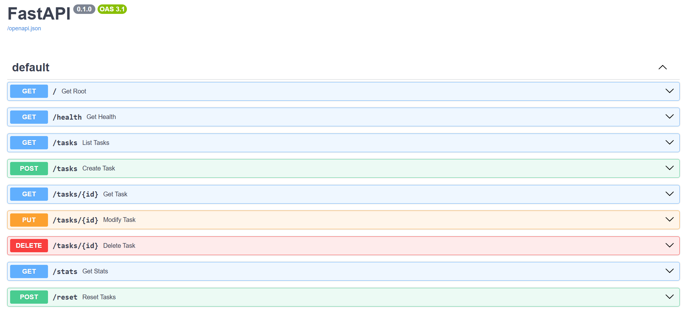
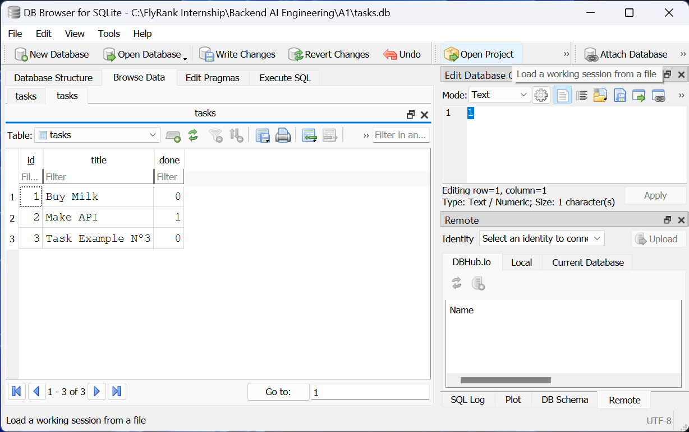
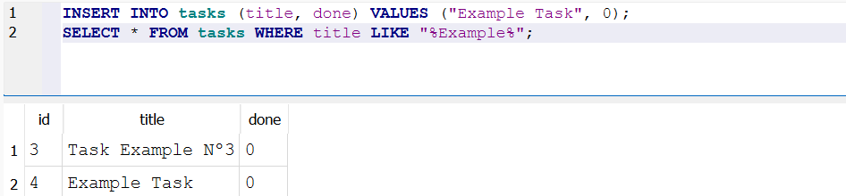

# To-Do List CRUD API

A simple To-Do List REST API built with **Python + FastAPI**, backed by a **SQLite** database. It supports creating, reading, updating and deleting tasks, plus filtering, search, computed statistics and a reset endpoint for testing.

Tasks are stored in a SQLite database file (`tasks.db`) — **data survives a server restart.**

## Requirements

- Python 3.13+
- [uv](https://docs.astral.sh/uv/) (package & project manager)

No database server to install: SQLite ships with Python.

## Installation

```powershell
# clone the repo, then from the project folder:
uv sync          # creates .venv and installs all dependencies from uv.lock
```

## Run the server

```powershell
uv run fastapi dev app/main.py
```

The API will be available at `http://localhost:8000`.

- Interactive docs (Swagger UI): http://localhost:8000/docs
- Alternative docs (ReDoc): http://localhost:8000/redoc

That single command is all a fresh clone needs — the database is created on first run.

## Database

### Why SQLite

- **It's a single file.** The whole database is `tasks.db`. Copy it, delete it, open it in a viewer — no server, no ports, no credentials.
- **Zero setup.** Python's `sqlite3` module is in the standard library, so there is nothing to install and nothing extra in `pyproject.toml`. A stranger cloning this repo runs one command and gets a working app.
- **Data survives restarts.** The previous version kept tasks in a Python dictionary, so everything was lost when the process stopped. That was the limitation this version removes.
- **Right size for the job.** One table, one user, no concurrent writers. PostgreSQL would be the choice for a multi-user service; here it would be pure overhead.

### Where the database lives

| | |
|---|---|
| File | `tasks.db`, in the project root |
| Created by | `app/db.py`, automatically on first run |
| Tracked in git? | No — it's in `.gitignore`, so every clone starts fresh |

The path is resolved relative to the source file, not the working directory, so the server always finds the same database no matter where it was launched from.

### Schema

One table, created with `CREATE TABLE IF NOT EXISTS` at startup:

```sql
CREATE TABLE tasks (
    id    INTEGER PRIMARY KEY,      -- assigned by SQLite
    title TEXT NOT NULL,
    done  BOOLEAN NOT NULL DEFAULT FALSE   -- stored as 0 / 1
)
```

SQLite has no boolean type — `done` is stored as `0` or `1` and converted back to a real boolean by the Pydantic models.

On first run only, three example tasks are seeded. The check is a row count (`SELECT COUNT(*) FROM tasks`), not a file-existence check, so restarting the server never duplicates them.

### Queries

All SQL runs in `app/tasks.py`, and every user-supplied value is passed as a `?` parameter rather than formatted into the query string:

```python
db.execute('SELECT * FROM tasks WHERE id = ?', (id,))
```

The statement is compiled before the value is bound, so input can never be interpreted as SQL.

## Endpoints

| Method | Path | Description | Success | Errors |
|--------|------|-------------|---------|--------|
| GET | `/` | API description | 200 | — |
| GET | `/health` | Health check | 200 | — |
| GET | `/tasks` | List tasks. Optional query params: `done` (bool), `search` (substring in title, case-insensitive) | 200 | 400 (invalid query) |
| GET | `/tasks/{id}` | Get one task by id | 200 | 404 |
| GET | `/stats` | Computed statistics: `{"total", "done", "open"}` | 200 | — |
| POST | `/tasks` | Create a task. Body: `{"title": "...", "done": false}` (`done` optional) | 201 | 400 (invalid/empty body) |
| POST | `/reset` | Reset the store to its initial state (3 example tasks) | 204 (no body) | — |
| PUT | `/tasks/{id}` | Update `title` and/or `done` | 200 | 400, 404 |
| DELETE | `/tasks/{id}` | Delete a task | 204 (no body) | 404 |

All errors are returned as JSON with the shape `{"error": "<message>"}`.

## Examples

### Get one task

```powershell
curl.exe -i http://localhost:8000/tasks/1
```

```
HTTP/1.1 200 OK
content-type: application/json

{"title":"Buy Milk","done":false,"id":1}
```

### Task not found → 404

```powershell
curl.exe -i http://localhost:8000/tasks/99
```

```
HTTP/1.1 404 Not Found
content-type: application/json

{"error":"Task 99 not found"}
```

### Create a task → 201

```powershell
curl.exe -i -X POST http://localhost:8000/tasks -H "Content-Type: application/json" --% -d "{\"title\":\"Buy milk\"}"
```

```
HTTP/1.1 201 Created
content-type: application/json

{"title":"Buy milk","done":false,"id":4}
```

### Filter and search

```powershell
curl.exe -i "http://localhost:8000/tasks?done=false&search=milk"
```

```
HTTP/1.1 200 OK
content-type: application/json

[{"title":"Buy Milk","done":false,"id":1}]
```

### Stats

```powershell
curl.exe -i http://localhost:8000/stats
```

```
HTTP/1.1 200 OK
content-type: application/json

{"total":3,"done":1,"open":2}
```

### Persistence

The point of the database, in three commands:

```powershell
curl.exe -X POST http://localhost:8000/tasks -H "Content-Type: application/json" --% -d "{\"title\":\"Survives a restart\"}"
# stop the server (Ctrl+C), then start it again
curl.exe -i http://localhost:8000/tasks
```

The task is still there. With the in-memory version it would have been gone.

## Swagger UI

FastAPI automatically generates interactive documentation at `/docs`, where every endpoint can be tried from the browser:



## The database in DB Browser

`tasks.db` opened in [DB Browser for SQLite](https://sqlitebrowser.org/) — the same three seeded tasks the API serves, as rows in a table:



### Running SQL by hand

The API and DB Browser read the same file, so a change made in one appears in the other with no restart and no syncing step:

```sql
INSERT INTO tasks (title, done) VALUES ("Example Task", 0);
SELECT * FROM tasks WHERE title LIKE "%Example%";
```



The `SELECT` returns two rows: the seeded `Task Example Nº3` and the `Example Task` just inserted. `LIKE "%Example%"` matches any title *containing* the word — `%` is SQL's wildcard, and it is the same query `GET /tasks?search=Example` runs.

One catch worth knowing: DB Browser keeps edits in an open transaction until **Write Changes** is clicked. Until then the new row is invisible to the API — and the database is locked against writes. "Write Changes" is the same operation as `db.commit()` in the application code.
